# 🏥 Frontend - Sistema de Gestión Quirúrgica DACS 2025

Interfaz Angular moderna para la gestión integral de citas y procedimientos quirúrgicos hospitalarios.

---

## 📋 Descripción General

Este proyecto es la **capa de presentación** de un ecosistema distribuido de gestión hospitalar. Se comunica con el backend a través del patrón **BFF (Backend For Frontend)**, que centraliza la lógica de seguridad, normaliza datos y optimiza las respuestas para el cliente.

### Arquitectura de Comunicación

```
┌─────────────────┐
│   Frontend      │ ◄─── Apollo Client (GraphQL)
│   (Angular)     │ ◄─── BFF (GraphQL Gateway)
└─────────────────┘
        ▲
        │ Redux Store (NgRx)
        │ State Management
        ▼
┌─────────────────┐
│   BFF Service   │
│  (Normalización │
│    de datos)    │
└─────────────────┘
        ▲
        │ REST API
        ▼
┌─────────────────┐
│   Microservicios│
│   (Backend)     │
└─────────────────┘
```

---

## 🚀 Stack Tecnológico

### 🎯 Framework Base
- **Angular:** v20.2.0+ - Framework progresivo para Single Page Applications
- **TypeScript:** v5.9.2 - Lenguaje tipado para JavaScript
- **Angular CLI:** v20.2.1 - Herramienta de scaffolding y build

### 📊 State Management (Redux Pattern)
- **NgRx:** v20.1.0 - Implementación de Redux para Angular
  - `@ngrx/store` - Gestión centralizada de estado global
  - `@ngrx/effects` - Orquestación de efectos secundarios y lógica asíncrona
  - `@ngrx/store-devtools` - DevTools para debugging y time-travel debugging

### 🔗 GraphQL & Comunicación
- **Apollo Client:** v4.1.9 - Cliente GraphQL completo
  - `apollo-angular` v14.0.0 - Integración nativa con Angular
  - `graphql` v16.14.0 - Lenguaje y herramientas GraphQL
  - `graphql-ws` v6.0.8 - WebSocket para suscripciones en tiempo real
  - Caché automático y normalización de datos
  - Gestión de errores y retry automático

### 🎨 UI & Componentes
- **Angular Material:** v20.2.11
  - Componentes Material Design listos para producción
  - Theming personalizado
  - Iconografía (Google Material Icons)
  - Componentes: Button, Card, Form, Dialog, Tabs, Table, Toolbar, Sidebar, etc.

- **Angular CDK:** v20.2.11 (Component Dev Kit)
  - Abstracciones comunes para componentes
  - Utilities para crear componentes accesibles
  - Drag & drop
  - Overlay y portal management

- **Angular Animations:** v20.2.0
  - Transiciones suaves entre vistas
  - Animaciones de componentes
  - Interactividad mejorada

### 🔐 Autenticación & Seguridad
- **Keycloak Angular:** v20.0.0
  - Integración SSO (Single Sign-On)
  - Gestión de sesiones
  - Interceptores automáticos de tokens

- **Keycloak JS:** v26.2.1
  - Cliente JavaScript nativo
  - Manejo de autenticación OpenID Connect
  - Refresh tokens automático

- **RBAC** - Control de Acceso Basado en Roles
  - Guards de rutas
  - Directivas de autorización
  - Integración con NgRx

### 📱 Enrutamiento & Arquitectura
- **Angular Router:** v20.2.0
  - Enrutamiento declarativo
  - Guards para protección de rutas
  - Lazy loading de módulos
  - Gestión de historial y parámetros

- **Angular Forms:** v20.2.0
  - Formularios reactivos
  - Validación personalizada
  - Two-way data binding
  - Gestión de estado de formularios

### 🔄 Programación Reactiva
- **RxJS:** v7.8.0
  - Observables y operadores
  - Gestión de flujos asíncrónos
  - Unsubscribe automático
  - Operadores: map, filter, switchMap, tap, etc.

- **Zone.js:** v0.15.0
  - Detección de cambios en Angular
  - Manejo de eventos asíncronos
  - Change detection optimization


### 🔋 Arquitectura Técnica
```
┌─────────────────────────────────────────┐
│         PRESENTACIÓN (Angular v20)      │
│    ┌───────────────────────────────┐    │
│    │   Material Components Layer   │    │
│    │   - Datagrids, Forms, Cards   │    │
│    └───────────────────────────────┘    │
├─────────────────────────────────────────┤
│      STATE MANAGEMENT (NgRx Store)      │
│    ┌───────────────────────────────┐    │
│    │  Actions | Reducers | Effects │    │
│    │  Selectors | Facade Pattern   │    │
│    └───────────────────────────────┘    │
├─────────────────────────────────────────┤
│      DATA LAYER (Apollo Client)         │
│    ┌───────────────────────────────┐    │
│    │ Queries | Mutations | Suscr.  │    │
│    │ Caché | Error Handling        │    │
│    └───────────────────────────────┘    │
├─────────────────────────────────────────┤
│ API Communication (GraphQL + HTTPClient)│
│         BFF Backend Service             │
└─────────────────────────────────────────┘
```

---

## 🎯 Funcionalidades Principales

### 🔐 1. Autenticación y Autorización
Gestión de usuarios integrada con **Keycloak**, soporte para múltiples roles y permisos granulares.

- Login/Logout seguro con SSO
- Control de acceso basado en roles (RBAC)
- Refresh tokens automático
- Gestión de cuenta de usuario

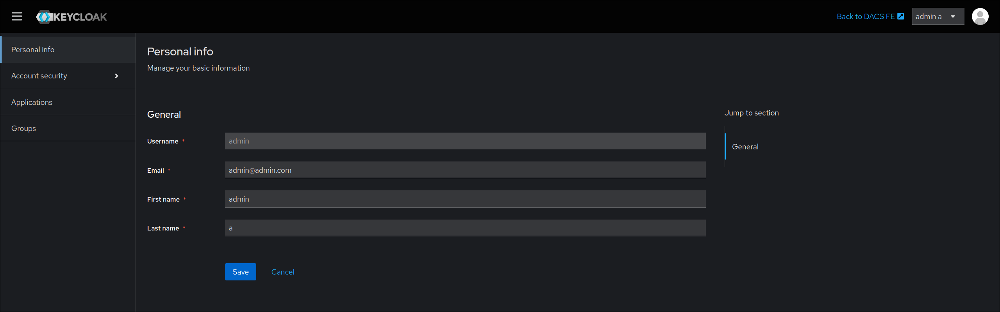
*Pantalla de login integrada con Keycloak - Autenticación SSO segura*


*Pantalla del flujo de login (versión PNG)*

---

### 📅 2. Dashboard y Visualización
Paneles informativos con datos en tiempo real sobre operaciones y métricas hospitalarias.

- **Calendario de Cirugías**: Visualiza procedimientos programados
- **Métricas Hospitalarias**: KPIs y estadísticas operacionales
- **Reportes**: Generación de informes descargables
- **Notificaciones**: Alertas en tiempo real

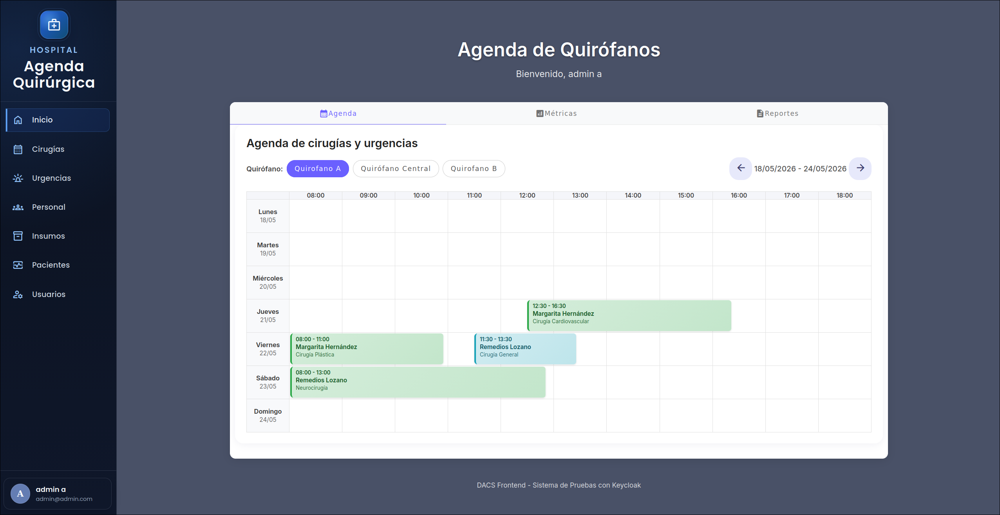
*Dashboard con vista de calendario de cirugías programadas*

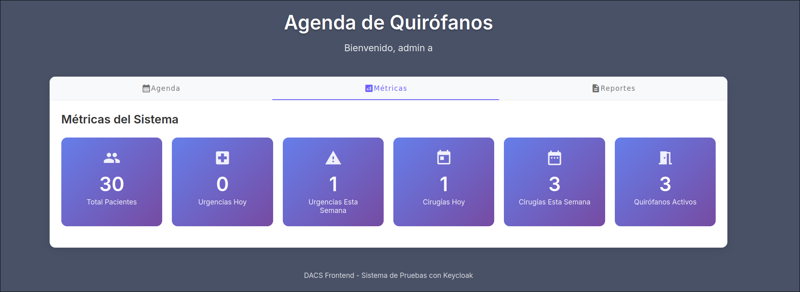
*Visualización de métricas hospitalarias en tiempo real*

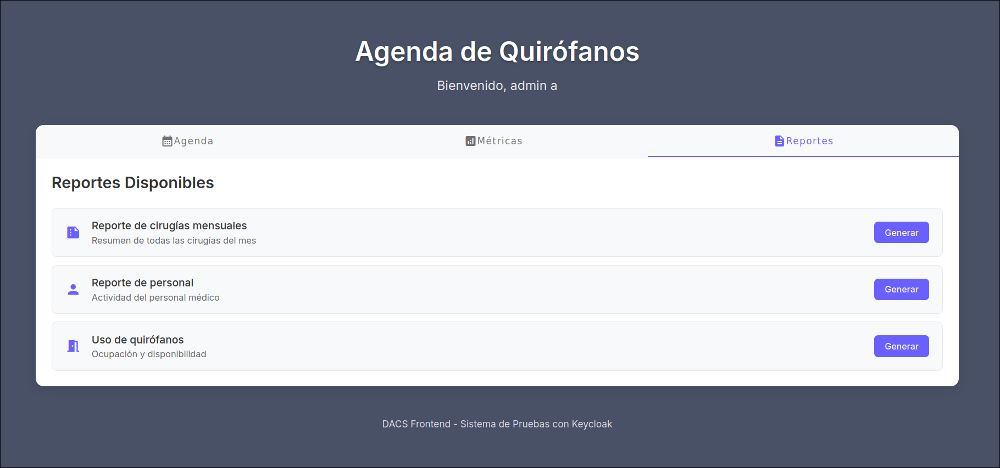
*Generación y descarga de reportes operacionales*

---

### 🏥 3. Gestión de Cirugías
Control completo del ciclo de vida de procedimientos quirúrgicos.

#### Funcionalidades:
- **Listado Avanzado**: Búsqueda, filtrado y ordenamiento
  - Filtrar por fecha, estado, paciente, quirófano
  - Búsqueda de texto completo
  
- **Crear Nueva Cirugía**:
  - Seleccionar paciente (existente o nuevo)
  - Asignar turno disponible
  - Configurar equipo médico
  - Establecer tipo de intervención

- **Gestión de Equipos Médicos**:
  - Añadir/eliminar personal médico
  - Asignar roles (cirujano, anestesiólogo, enfermeras)
  - Ver disponibilidad de recursos

- **Finalización de Cirugía**:
  - Registrar intervenciones realizadas
  - Documentar incidentes
  - Marcar como completada

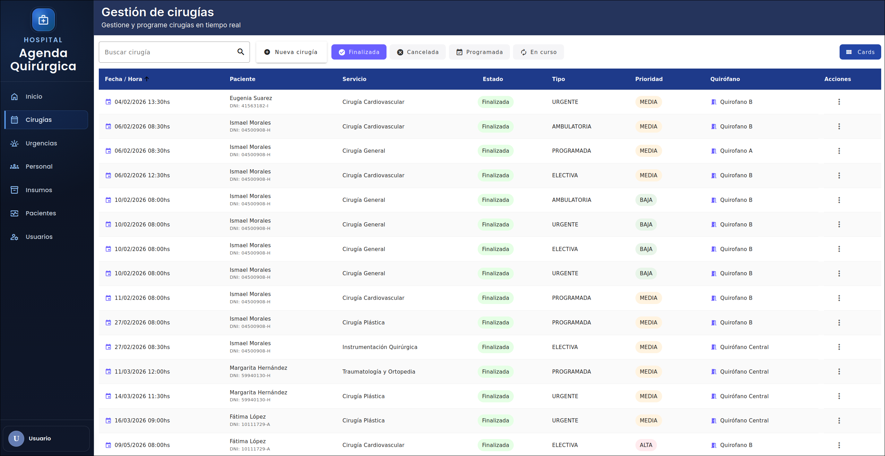
*Tabla con filtrado avanzado de cirugías programadas y estados*

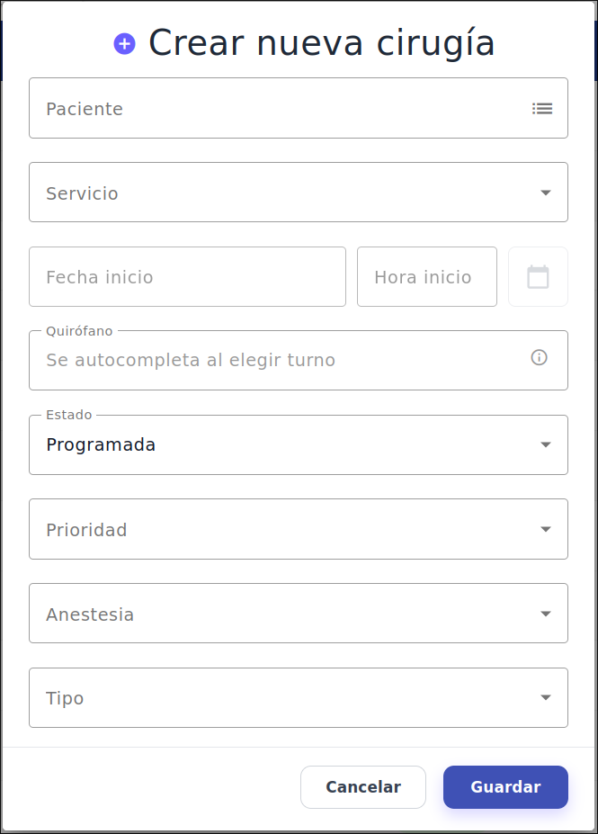
*Formulario de creación: seleccionar paciente*

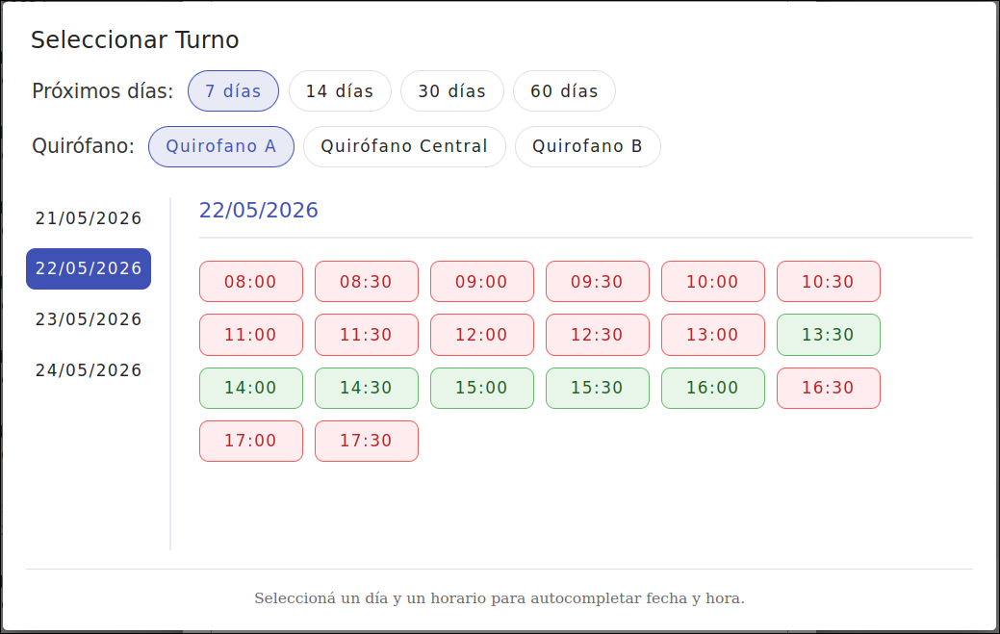
*Seleccionar turno disponible en el quirófano*

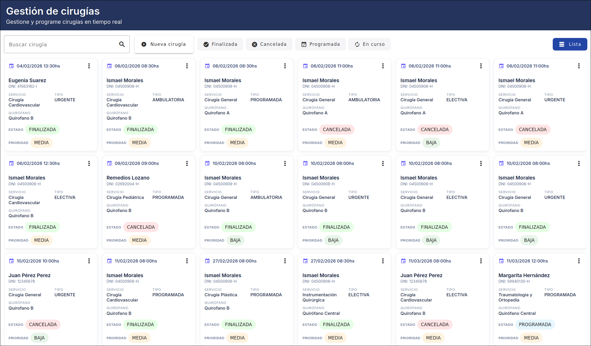
*Interfaz para asignar roles y personal médico a la cirugía*


*Vista detallada de una cirugía con historial, intervenciones y notas.*

---

### 👥 4. Gestión de Pacientes
Administración integral de datos de pacientes.

- **Listado de Pacientes**: Búsqueda avanzada y filtrado
- **Añadir Paciente**: 
  - Registro manual
  - Importar desde API externa
  - Validación automática de datos

- **Perfil de Paciente**: Ver historial y antecedentes
- **Búsqueda Avanzada**: Por ID, nombre, documento, etc.

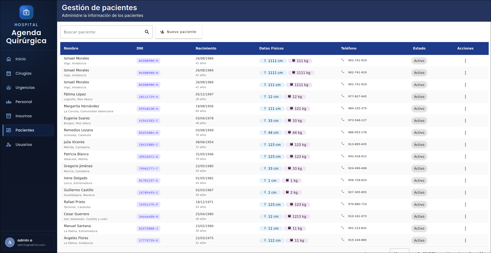
*Tabla completa de pacientes con búsqueda y filtrado avanzado*

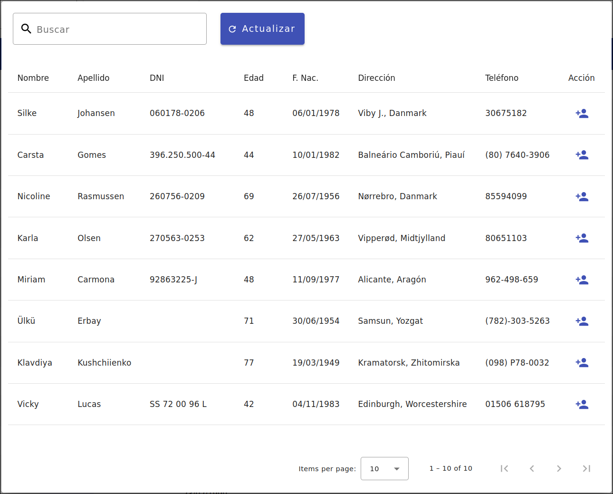
*Interfaz para importar pacientes desde API externa e integración con sistemas externos*

---

### 👨‍⚕️ 5. Gestión de Personal
Control del equipo médico y administrativo.

- **Listado de Personal**: Búsqueda y filtrado
- **Crear Personal**: Registrar nuevos miembros
- **Editar Perfil**: Actualizar datos y rol
- **Asignar Turnos**: Disponibilidad y horarios

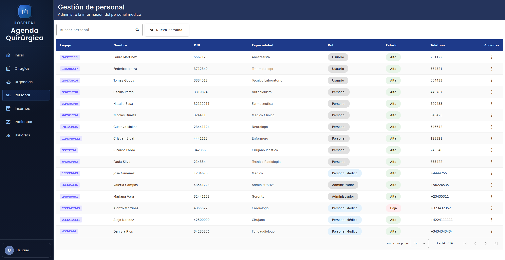
*Panel de gestión del personal médico y administrativo del hospital*

---

### 👤 6. Gestión de Usuarios y Roles
Administración de acceso a través de Keycloak.

- **Listado de Usuarios**: Visualizar todos los usuarios del sistema
- **CRUD de Usuarios**: Crear, actualizar, eliminar
- **Gestión de Roles**: Asignar permisos y roles
- **Configuración de Cuenta**: Cambiar contraseña, perfil

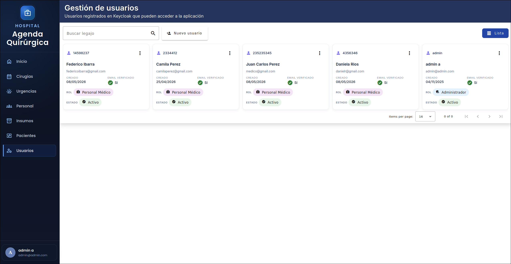
*Vista de todos los usuarios registrados en el sistema*

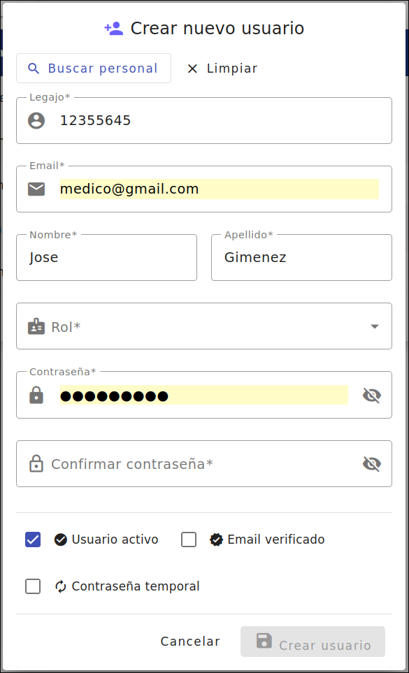
*Edición de perfil de usuario y asignación de roles*

---

### 📊 7. Gestión de Recursos Hospitalarios
Administración de quirófanos y disponibilidad.

- **Quirófanos**: Disponibilidad y turnos
- **Tipos de Intervención**: Catálogo de procedimientos
- **Urgencias**: Gestión de casos urgentes

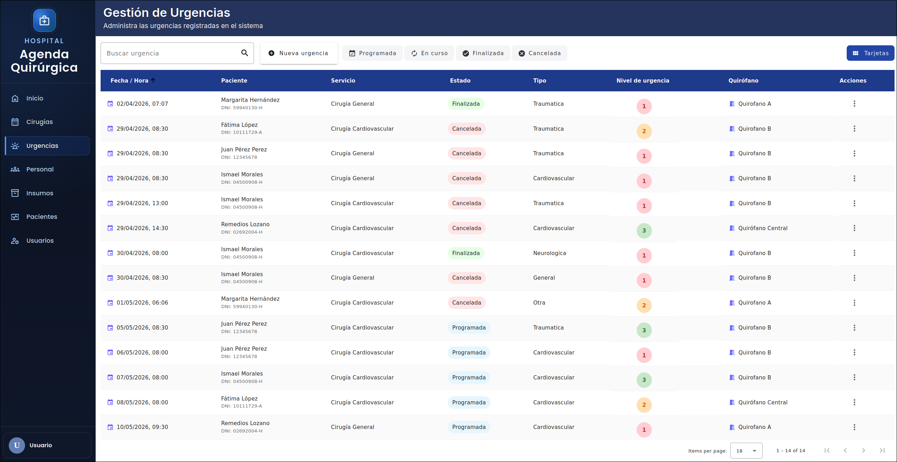
*Gestión de quirófanos, turnos disponibles y casos urgentes*

---

## 🏗️ Arquitectura del Proyecto

```
src/
├── app/
│   ├── core/
│   │   ├── guards/              # Guards de autenticación
│   │   ├── interceptors/        # Interceptores HTTP
│   │   └── services/            # Servicios compartidos
│   │
│   ├── shared/
│   │   ├── components/          # Componentes reutilizables
│   │   └── utilities/           # Utilidades globales
│   │
│   ├── store/                   # NgRx Store (Redux)
│   │   ├── actions/
│   │   ├── reducers/
│   │   ├── effects/
│   │   └── selectors/
│   │
│   ├── graphql/                 # Configuración GraphQL/Apollo
│   │   ├── queries.graphql
│   │   └── mutations.graphql
│   │
│   ├── features/                # Features por módulo
│   │   ├── dashboard/
│   │   ├── cirugia/
│   │   ├── paciente/
│   │   ├── personal/
│   │   ├── usuarios/
│   │   └── urgencia/
│   │
│   └── app.config.ts            # Configuración global
│
├── assets/
├── environments/
└── styles/
```

---

## 🔄 Flujo de Datos: Redux + GraphQL

### 1. Sistema de Redux (NgRx)
```
Componente → Dispatch Action
    ↓
Effects → Llama a BFF (GraphQL)
    ↓
Reducer → Actualiza Estado
    ↓
Selector → Componente recibe datos
    ↓
Pantalla actualizada
```

### 2. Consultas GraphQL
Todas las consultas se realizan a través del **BFF GraphQL**:

```graphql
# Obtener lista de cirugías
query GetCirugias {
  cirugias(filtros: {...}) {
    id
    paciente { nombre }
    fechaInicio
    estado
  }
}

# Crear nueva cirugía
mutation CreateCirugia($input: CirugiaInput!) {
  createCirugia(input: $input) {
    id
    estado
  }
}

# Suscribirse a cambios en tiempo real
subscription OnCirugiaUpdated {
  cirugiaUpdated {
    id
    estado
  }
}
```

---

## 📚 Aprendizajes y Mejores Prácticas

- ✅ **Arquitectura Modular**: Separación clara de responsabilidades
- ✅ **State Management**: Redux con NgRx para estado predecible
- ✅ **GraphQL**: Consultas optimizadas y tipado estricto
- ✅ **Componentes Reutilizables**: DRY principles
- ✅ **Diseño Responsivo**: Mobile-first approach
- ✅ **Seguridad**: Integración RBAC con Keycloak
- ✅ **Performance**: Lazy loading, OnPush detection strategy
- ✅ **BFF Pattern**: Normalización de datos desde el inicio

---

## 🔗 Ecosistema Completo

Este frontend es parte de un ecosistema distribuido. Explora todos los componentes:

👉 **[Surgical Management System - GitHub Organization](https://github.com/orgs/surgical-management-system/repositories)**

### Componentes del Sistema:
- **Frontend**: Interfaz Angular (este proyecto)
- **BFF**: Backend For Frontend (Normalización de datos)
- **Backend**: Microservicios Java Spring Boot
- **Connector**: Conectores a APIs externas
- **Database**: PostgreSQL con migraciones
- **Infrastructure**: Docker, Nginx, configuración
