# FrontEnd-DACS2025 🏥

Angular interface for hospital appointment management: essential features ready; further improvements and optimizations to be implemented.

## Description
This project is the presentation layer of the ecosystem. Its architecture is designed to communicate with the backend using a **BFF (Backend For Frontend)** pattern, which centralizes security logic and normalizes data coming from the backend.

## Objective

## System Architecture
This frontend is part of a distributed architecture. You can see all components, microservices, and the complete infrastructure in our GitHub organization:

👉 **[Explore the Surgical Management System ecosystem](https://github.com/orgs/surgical-management-system/repositories)**

## Technology Stack
- **Framework:** Angular (v18/19)
- **Language:** TypeScript
- **Styles:** CSS3, Angular Material
- **Communication:** REST API with BFF integration
- **Security:** Role-Based Authentication and Authorization (RBAC)
- **Version control:** Git
- **API consumption:** HTTP REST

## Features

- User authentication and authorization via Keycloak.
  
	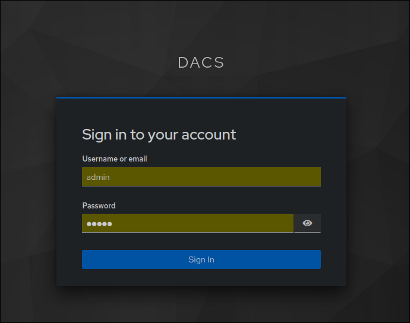

- Visualization of scheduled surgeries

    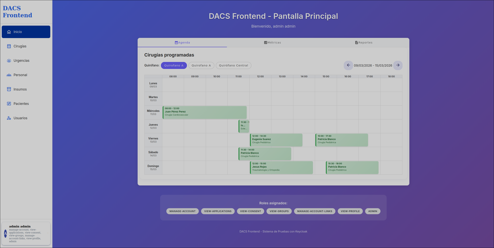

- Visualization of metrics

    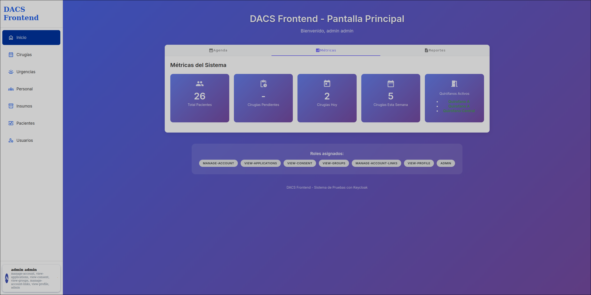

- Reports

    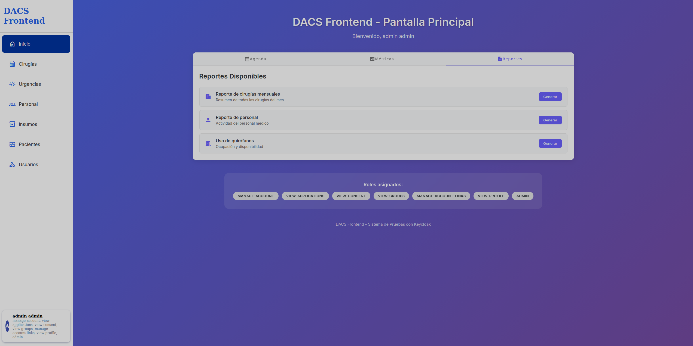

- Listing and filtering of surgeries.

    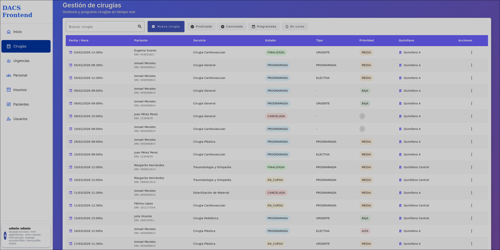

    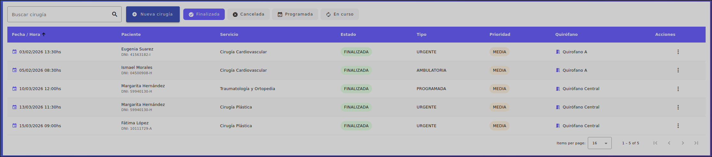

- Management of surgeries and medical teams.

    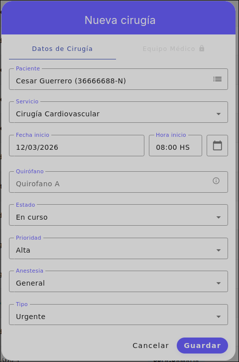

    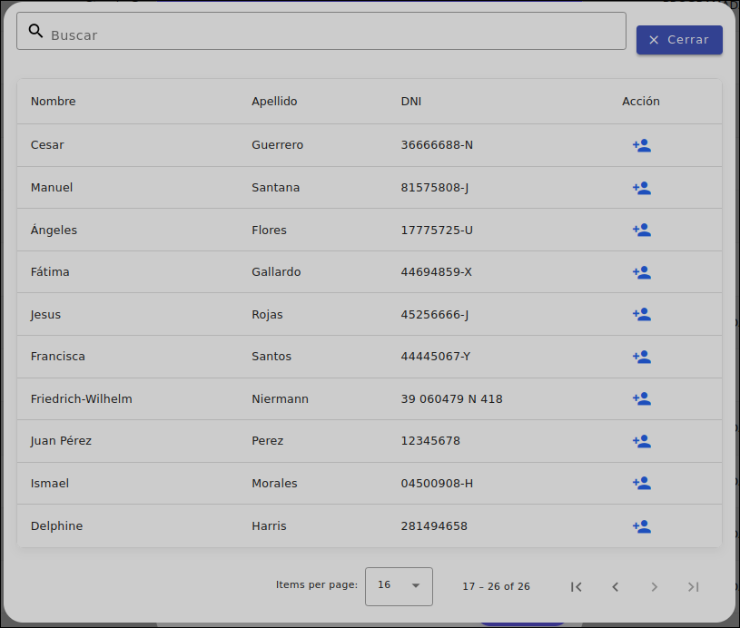

    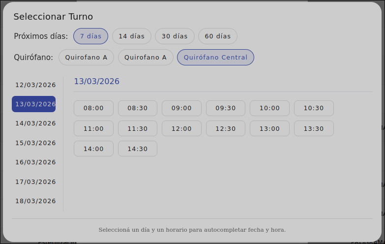

    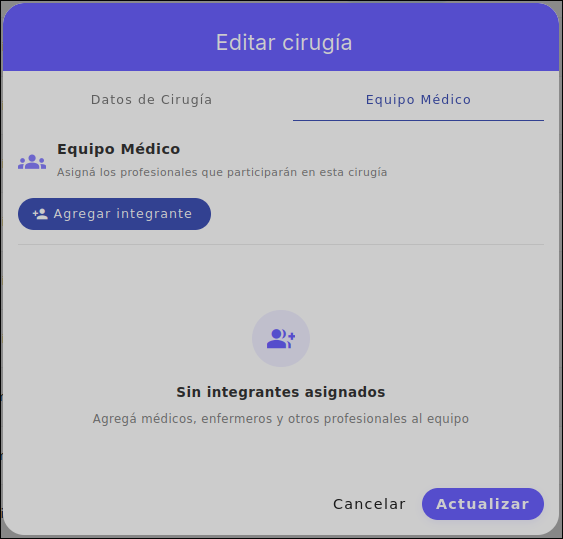

    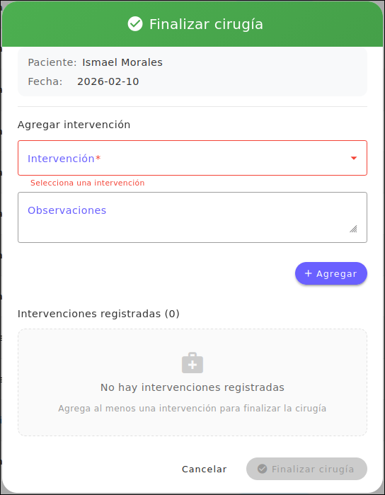

- Staff management.

    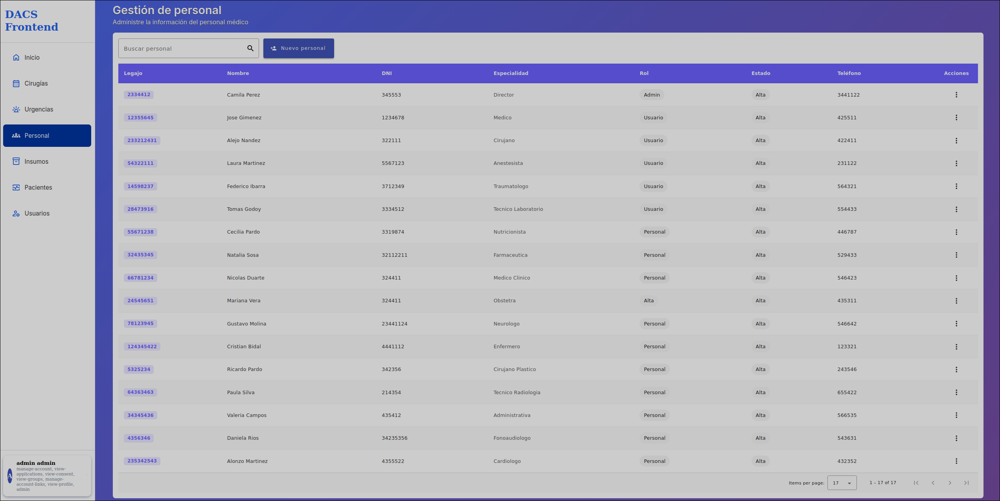

- Patient management: listing and advanced search.

	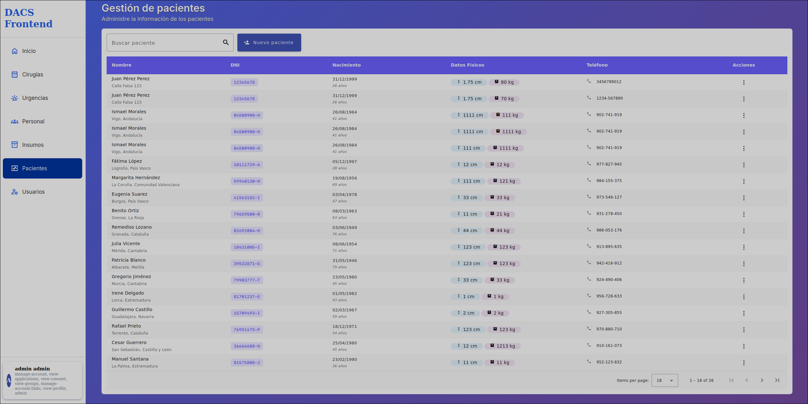

- Patient registration from external API.

    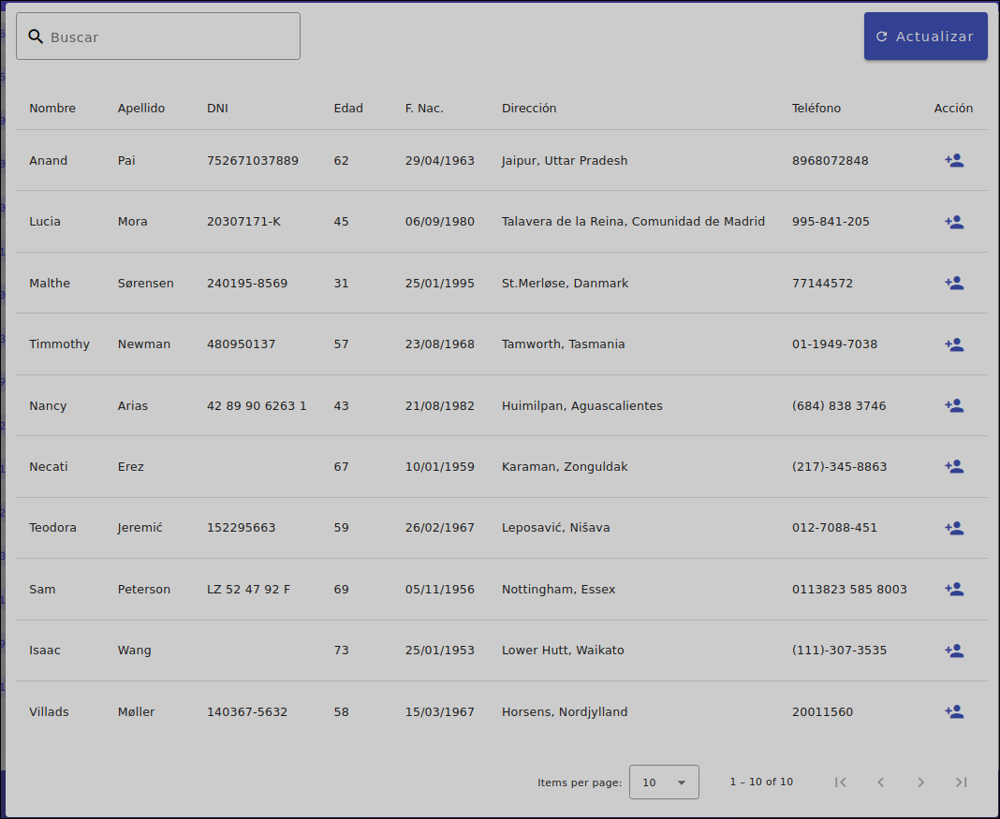

    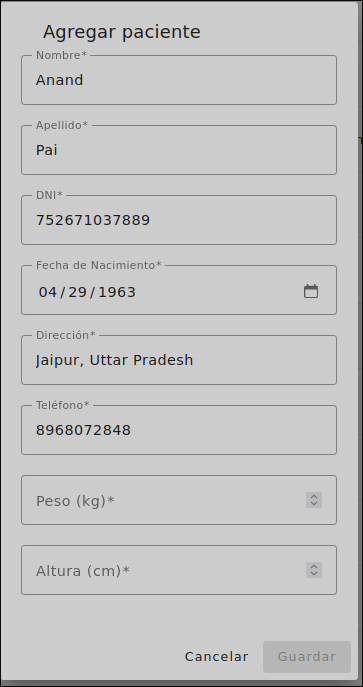

- User/role management using Keycloak API

    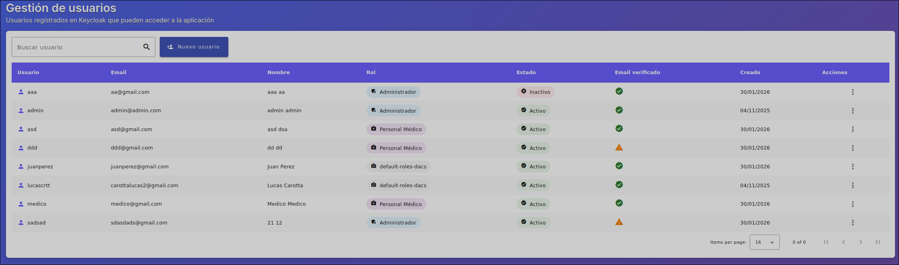

    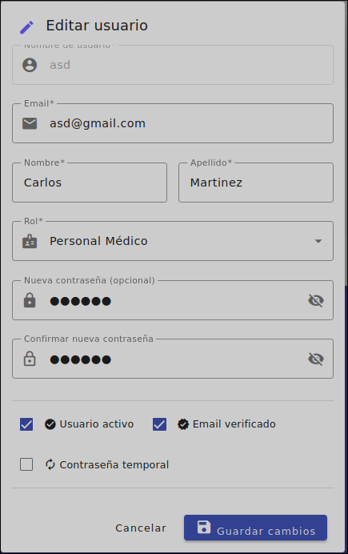

- Account management via Keycloak

    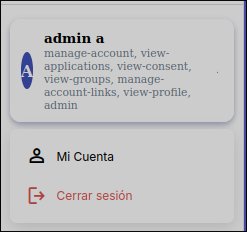

    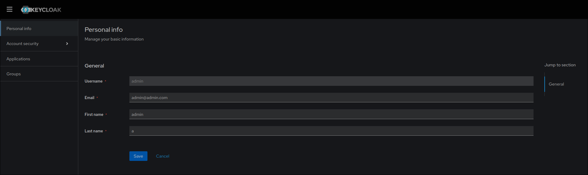

## Learnings and Experience

- Deepening in the development of SPA applications with Angular and good architectural practices.
- Integration of robust authentication and authorization systems + Roles (Keycloak).
- Implementation of reusable components and responsive design.
- State management, services, and efficient communication with APIs REST.
- Improved user experience (UX/UI) using Angular Material.
- Implementation of the BFF pattern.

## Configuration
[View the infrastructure configuration (PDF)](assets/DACS-configuracion-de-infraestructura.pdf)
